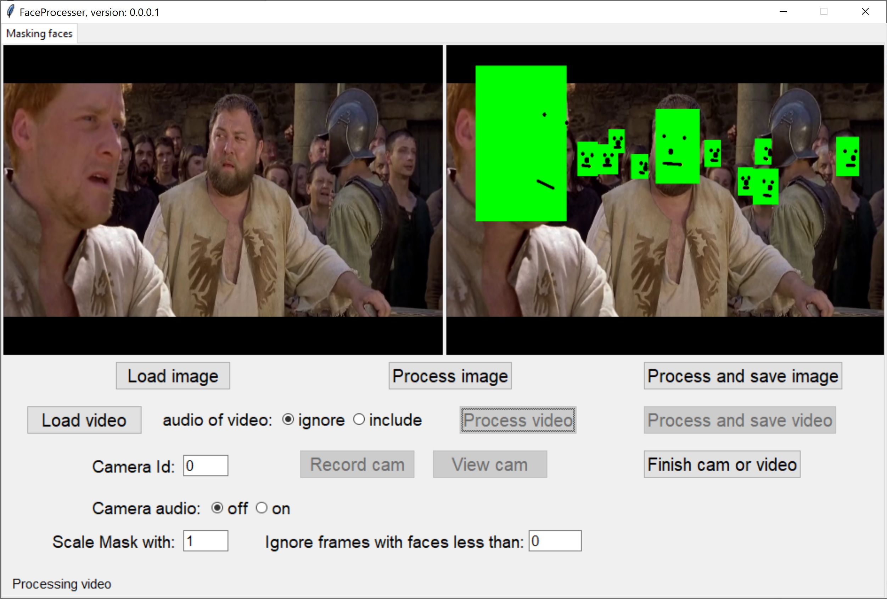
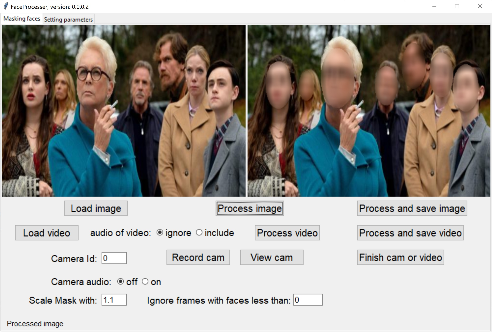

# FaceProcessor
### Latest version 0.0.0.2
1) A filtering section is included, which supports blurring.
2) You can choose mask types in rectangle and ellipse.
3) Also, colors of features of each face can be changed in the new tab: setting parameters.
4) You may blur the faces, nonfaces, or the whole image.
## This archive includes the executable program, **FaceProcessor.exe**, which you should click on to run.
[Download the archive for win64 (Windows 10 and over)](https://drive.google.com/file/d/1SQoq_RgLedhyZAopQYoTCeKXlGKgKlKD/view?usp=share_link)
---
### Older version 0.0.0.1
1) Now we support handling **audio** along video.
2) You can also record audio and video together using your **microphone** and **camera**.
3) Buttons are disabled and enabled to help the user.
4) A simple status bar is also included. 
## This archive includes the executable program, **FaceProcessor.exe**, which you should click on to run.
[Download the archive for win64 (Windows 10 and over)](https://drive.google.com/file/d/1WmFYgs660zcXtkXz2pOJzF3h-MqvWSC9/view?usp=share_link)
---
### Older version 0.0.0.0
1) This app can detect and cover faces in an image.
2) It can also mask faces in a video file or webcam.
3) You can increase or decrease the size of mask.
4) If You know the minimum number of faces in a video or webcam, you can set it manually.
## This archive includes the executable program, **FaceProcessor.exe**, which you should click on to run.
[Download the archive for win64 (Windows 10 and over)](https://drive.google.com/file/d/1Vvqb85g9dx5jr9LDH-PQ23bLZVYqx2Yp/view?usp=share_link)
---
 *Figure 1: A snapshot of FaceProcessor, version 0.0.0.0, while detecting and masking the faces.*
---
 *Figure 2: A snapshot of FaceProcessor, version 0.0.0.1, while detecting and masking the faces and handling audio.*
---
 *Figure 3: A snapshot of FaceProcessor, version 0.0.0.2, while detecting and blurring the faces.*
---