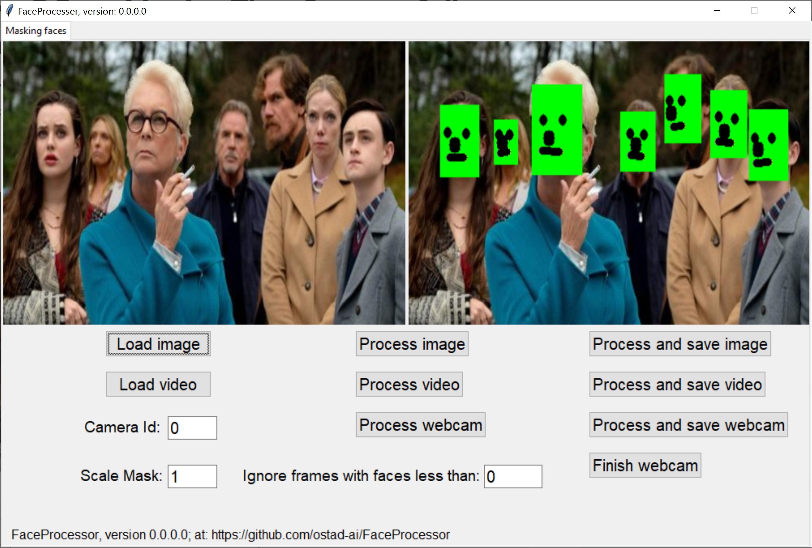

# FaceProcessor
### Newest version 0.0.0.0
1) This app can detect and cover faces in an image.
2) It can also mask faces in a video file or webcam.
3) You can increase or decrease the size of mask
4) If You know the minimum number of faces in a video or webcam, you can set it manually.
## This archive includes the executable program, **FaceProcessor.exe**, which you should click on to run.
[Download the archive for win64 (Windows 10)](https://drive.google.com/file/d/1Vvqb85g9dx5jr9LDH-PQ23bLZVYqx2Yp/view?usp=share_link)
---
 *Figure 1: A snapshot of FaceProcessor, version 0.0.0.0, while finding and masking the faces.*
---
